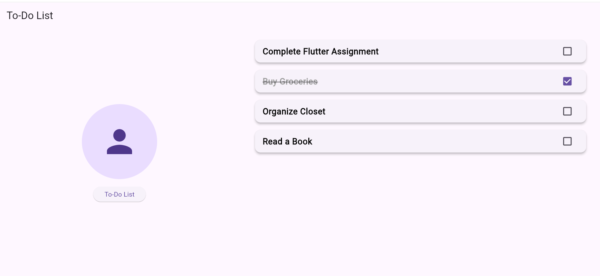

# SZ To-Do List  

A Flutter-based To-Do List app with a modern UI and adaptive layout.

## How to Run  
1. Clone the repository.  
2. Run `flutter pub get` to install dependencies.  
3. Use `flutter run` to start the app.  

## Group Members  
- Member 1: Ariha Zainab (2280138)  
- Member 2: Marrium Shaikh (2280147)
 

## Screenshots  
  
  
  

## Features  
✅ Modern UI with adaptive design (works in both portrait & landscape)
✅ Task Completion with Strikethrough for completed tasks
✅ AppBar with title for structured navigation
✅ ListView for task display
✅ Checkbox for marking tasks as complete
✅ FloatingActionButton for future actions 

## Getting Started

This project is a starting point for a Flutter application.

A few resources to get you started if this is your first Flutter project:

- [Lab: Write your first Flutter app](https://docs.flutter.dev/get-started/codelab)
- [Cookbook: Useful Flutter samples](https://docs.flutter.dev/cookbook)

For help getting started with Flutter development, view the
[online documentation](https://docs.flutter.dev/), which offers tutorials,
samples, guidance on mobile development, and a full API reference.
